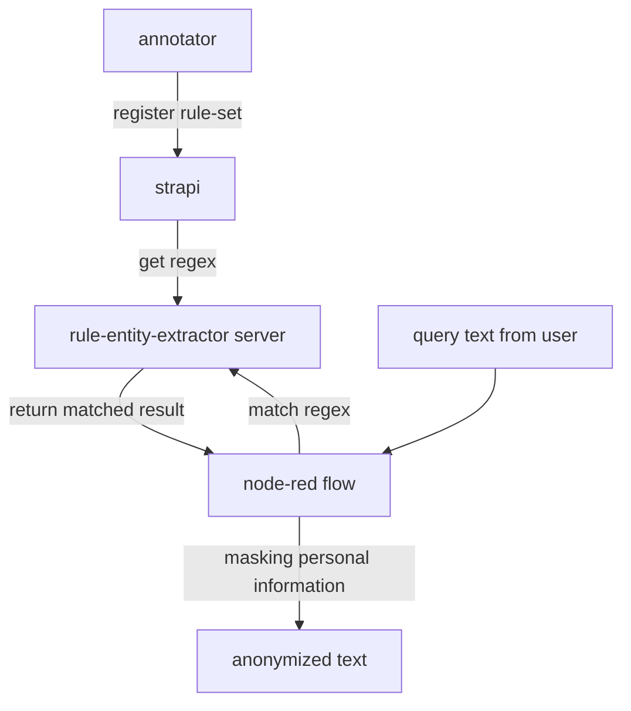

# lina_anonymizer
text anonymizer based on flow

```mermaid
graph TD;
    AA[annotator] --> |register rule-set|A
    A[strapi]-->|get regex|B[rule-entity-extractor server];
    B --> |return matched result|C[node-red flow];
    C --> |match regex|B;
    Q[query text from user] --> C;
    C --> |masking personal information|D[anonymized text];
```
