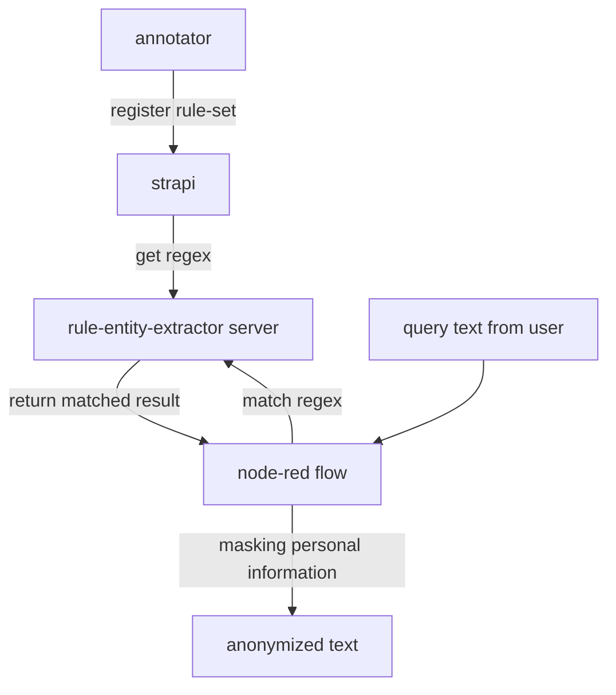

# lina_anonymizer
text anonymizer based on flow

## overall workflow

## initial setting
prepare below docker images

strapi/strapi
rule_entity_extractor_anonymizer(build from rule-entity-extractor folder)
nodered_anonymizer(build from node-red folder)
streamlit_anonymizer(build from streamlit folder)

## running command

### strapi(showing)
	docker run -it -p 18501:1337 -v `pwd`/strapi_anonymizer:/srv/app strapi/strapi

### rule-entity-extractor
    export META_ENDPOINT=localhost:18501/
    docker run -e META_ENDPOINT -p 18086:8000 rule_entity_extractor_anonymizer:0.1 
    
### node-red
    docker run -p 18087:1880 nodered_anonymizer:0.1

### streamlit(showing)
    docker run -p 18502:8001 streamlit_anonymizer:0.1

