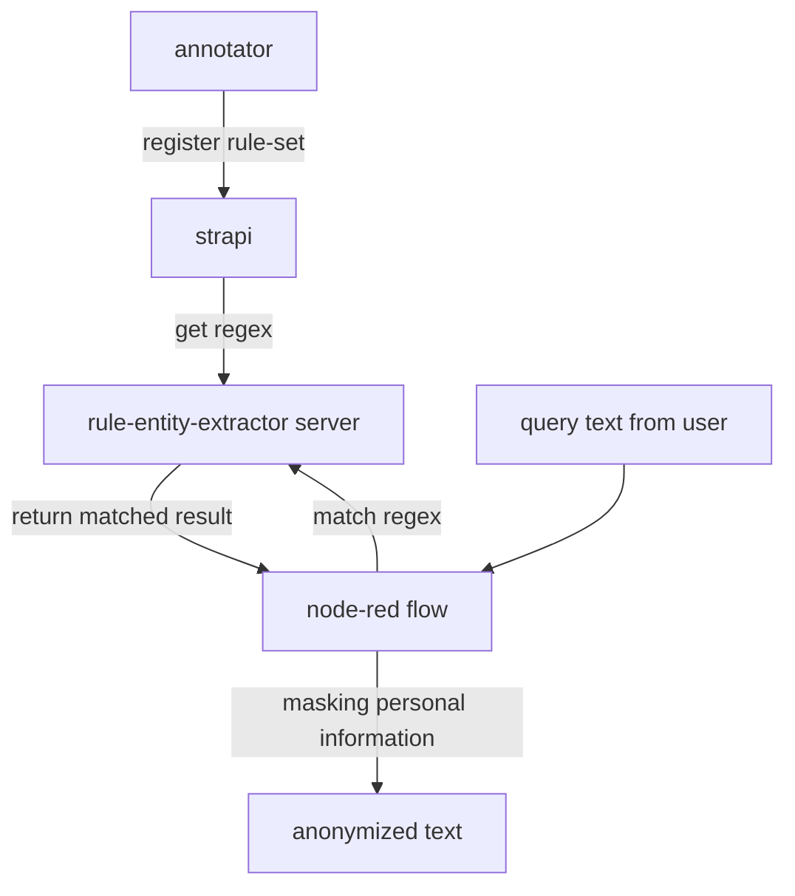

# lina_anonymizer
text anonymizer based on flow

## overall workflow

## initial setting

### strapi
	docker run -it -p 1338:1337 -v strapi:/srv/app strapi/strapi

### rule-entity-extractor
    after setting META_ENDPOINT env

    uvicorn inferencer:app --host=0.0.0.0 --port=8001
    
### node-red
    docker run -it -p 1881:1880 -v node-red:/data --name anonymizer-flow nodered/node-red

### streamlit

