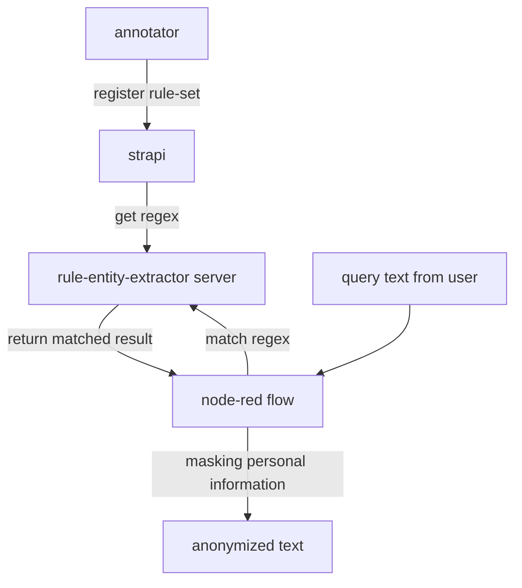

# lina_anonymizer
text anonymizer based on flow

## overall workflow

## initial setting
prepare below docker images

- strapi/base

- strapi_anonymizer(build from strapi_meta)

- rule_entity_extractor_anonymizer(build from rule-entity-extractor folder)

- nodered_anonymizer(build from node-red folder)

- streamlit_anonymizer(build from streamlit folder)

## running command(check host ip for setting module endpoint)

### strapi(showing)
    #create  strapi project from create_strapi_project.sh (manually)
    docker build -t strapi_anonymizer:0.3 .
    docker run -p 18501:1337 strapi_anonymizer:0.3
    
### rule-entity-extractor
    docker build -t rule_entity_extractor_anonymizer:0.1 .
    docker run -e META_ENDPOINT=localhost:18501/ -p 18086:8000 rule_entity_extractor_anonymizer:0.1 
    
### node-red
    docker build -t nodered_anonymizer:0.1 .
    docker run -e RULE_SERVER_ADDR=localhost:18086 -p 18087:1880 nodered_anonymizer:0.1

### streamlit(showing)
    docker build -t streamlit_anonymizer:0.1 .
    docker run -e NODRED_ADDR=localhost:18087 -p 18502:8001 streamlit_anonymizer:0.1
