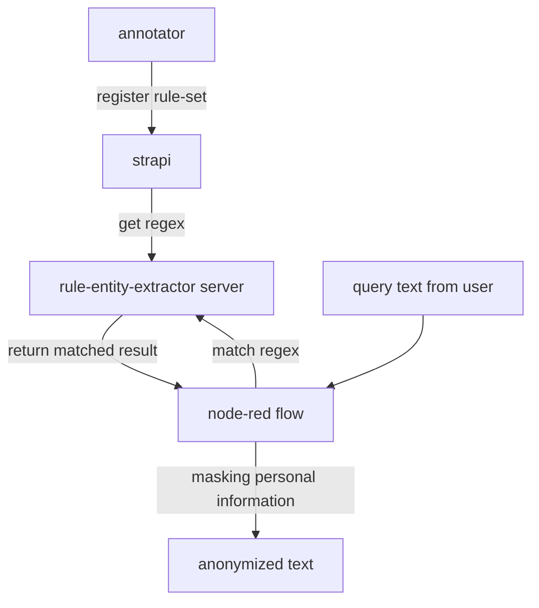
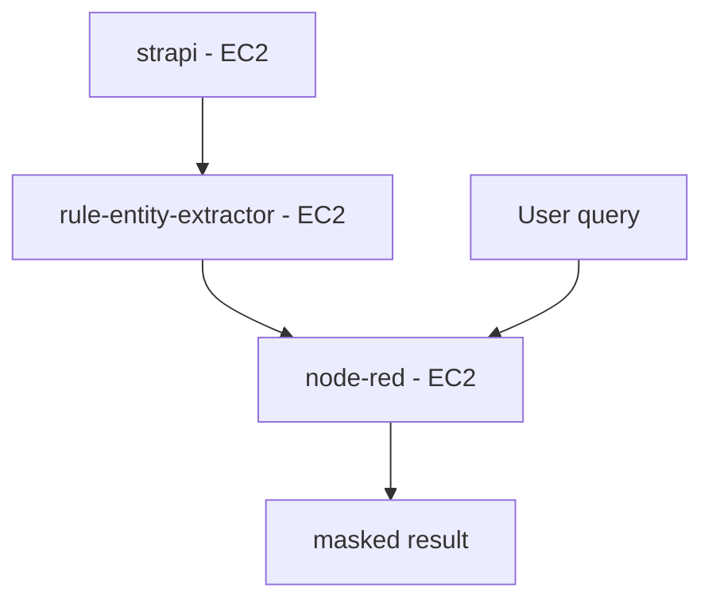
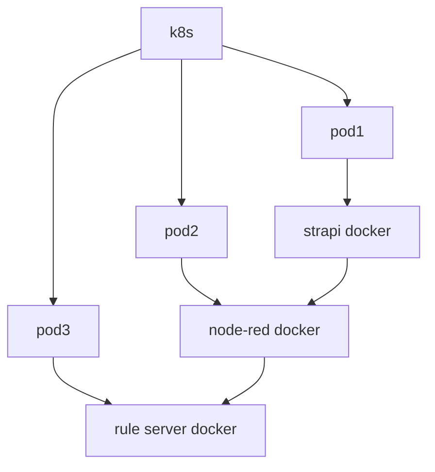

# lina_anonymizer
text anonymizer based on flow

## overall workflow

## Architecture(As-is)

## Architecture(To-be)

## To-do
- 현업들과의 미팅을 통한 온톨로지 구축
- 쉬운 정규식 generator 가능?
- 회사 관점에서의 결과값(로그)를 통한 메트릭 추출이 가능?
- 실시간 inference 환경에서는 고객 정보 실시간 업데이트 가능(엔티티 제대로 추출할 경우)!
- 
